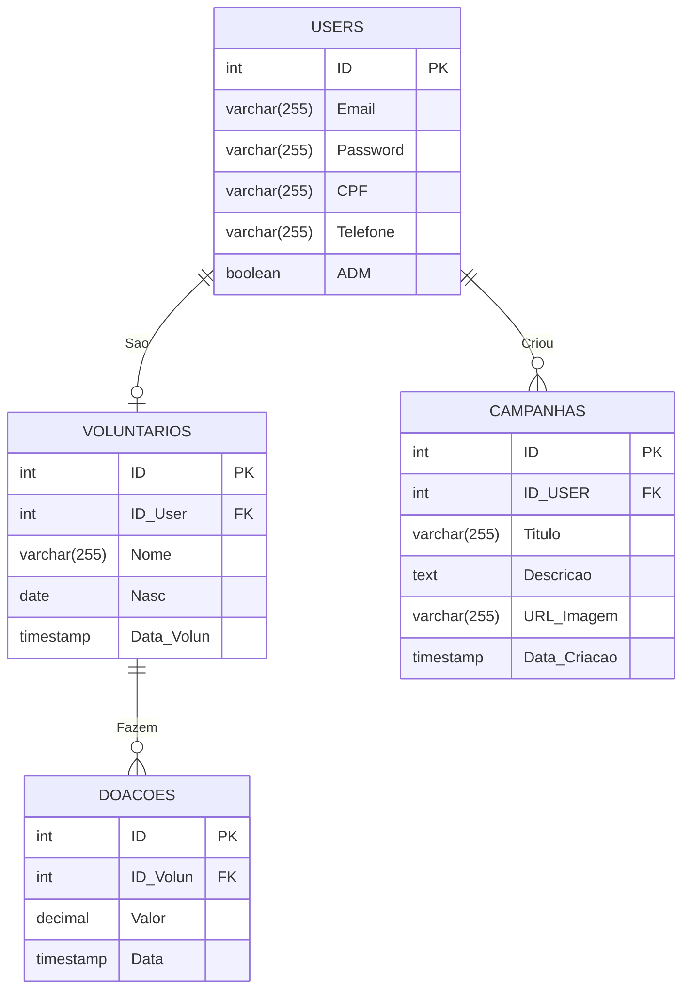

```mermaid
erDiagram

    USERS{
        int ID PK
        varchar(255) Email
        varchar(255) Password
        varchar(255) CPF
        varchar(255) Telefone
        boolean ADM

    }

    VOLUNTARIOS{
        int ID PK
        int ID_User FK
        varchar(255) Nome
        date Nasc
        timestamp Data_Volun
    }


    DOACOES{
        int ID PK
        int ID_Volun FK
        decimal Valor
        timestamp Data
    }

    CAMPANHAS{
        int ID PK
        int ID_USER FK 
        varchar(255) Titulo
        text Descricao
        varchar(255) URL_Imagem
        timestamp Data_Criacao
    }

    USERS ||--o| VOLUNTARIOS : "Sao"
    VOLUNTARIOS ||--o{ DOACOES : "Fazem"
    USERS ||--o{ CAMPANHAS: "Criou"


```

<!-- Símbolo	Significado
||--||	Um para exatamente um
||--o|	Um para zero ou um
||--o{	Um para zero ou muitos
||--|{	Um para um ou muitos
o|--|{	Zero ou um para um ou muitos -->
